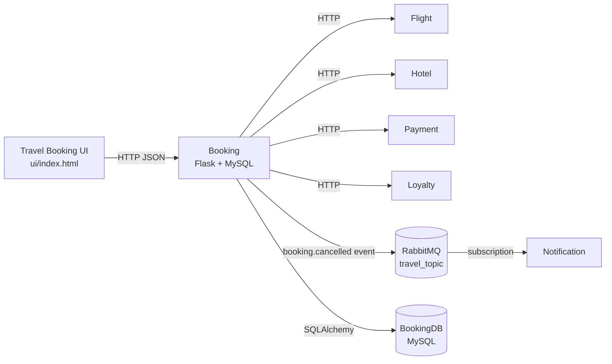
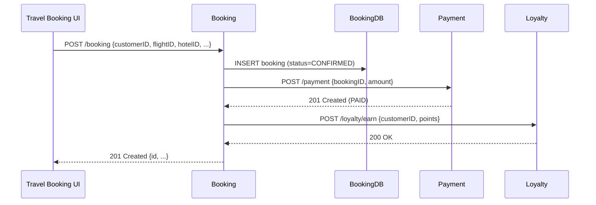
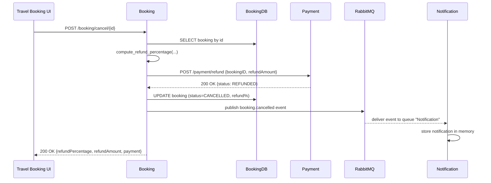

# Diagrams for Travel Booking Microservices Project

## 1. High-level SOA / Layer Diagram (Text Description)

- **Presentation Layer**
  - `Travel Booking UI` (browser, `ui/index.html`)
    - Sends HTTP requests to the `Booking` microservice.

- **Business / Composite Services Layer**
  - `Booking` microservice
    - Composite service for:
      - Create booking (flight + hotel bundle).
      - Cancel booking and compute refund.
    - Talks to:
      - `Payment` (HTTP) for initial charge & refund.
      - `Loyalty` (HTTP) to earn/adjust points.
      - Publishes events to RabbitMQ for `Notification`.

- **Atomic Services Layer**
  - `Flight` microservice
  - `Hotel` microservice
  - `Payment` microservice
  - `Loyalty` microservice
  - `Notification` microservice (also acts as event consumer).

- **Data Layer**
  - `BookingDB` (MySQL, owned by Booking).
  - In-memory "fake DBs" inside Flight, Hotel, Payment, Loyalty, Notification.

---

## 2. Technical Overview Diagram (Mermaid)

---

## 3. Microservice Interaction – Book Travel Package

**Main happy path: create booking and charge payment.**

1. **UI**  
   - `POST /booking` with `customerID`, `flightID`, `hotelID`, `departureTime`, `totalPrice`, `fareType`, `loyaltyTier`.
2. **Booking microservice**
   - Validates input.
   - Persists booking to `BookingDB` with status `CONFIRMED`.
   - (Optional extension) Calls:
     - `POST /payment` to charge the amount.
     - `POST /loyalty/earn` for earning points.
3. **Response to UI**
   - Returns booking details including generated `id`.

You can show this as a sequence diagram:

---

## 4. Microservice Interaction – Cancellation + Refund (Orchestration + Messaging)

**Scenario:** Traveller cancels a bundled booking, system computes refund based on fare type and loyalty tier, processes refund, and notifies via event.

1. **UI**
   - `POST /booking/cancel/{bookingID}`.
2. **Booking**
   - Loads booking from `BookingDB`.
   - Computes `refundPercentage` using:
     - Days between `now()` and `departureTime`.
     - `fareType` (`Saver`, `Standard`, `Flexi`).
     - `loyaltyTier` (Gold gets uplift).
   - Derives `refundAmount = totalPrice * refundPercentage / 100`.
3. **Payment**
   - Booking calls `POST /payment/refund` with `bookingID`, `refundAmount`.
   - Payment returns `status = REFUNDED`.
4. **Booking (DB update)**
   - Updates row in `BookingDB`:
     - `status = CANCELLED`
     - `refundPercentage`, `refundAmount`.
5. **Messaging via RabbitMQ**
   - Booking publishes `booking.cancelled` event to `travel_topic` exchange.
   - Payload includes bookingID, customerID, refund details, fareType, loyaltyTier, timestamp.
6. **Notification**
   - Subscribes to `booking.cancelled` via queue `Notification`.
   - Appends event to in-memory list and exposes it via `GET /notifications`.

Sequence diagram:

---

## 5. Data Model Diagram (Text)

- **BookingDB – `bookings` table (owned by Booking microservice)**
  - `id` (INT, auto increment, PK)
  - `customerID` (INT)
  - `flightID` (VARCHAR)
  - `hotelID` (INT)
  - `departureTime` (VARCHAR / ISO datetime string)
  - `totalPrice` (FLOAT/DECIMAL)
  - `currency` (VARCHAR)
  - `fareType` (VARCHAR) – e.g. `Saver`, `Standard`, `Flexi`
  - `loyaltyTier` (VARCHAR, nullable) – e.g. `Bronze`, `Silver`, `Gold`
  - `status` (VARCHAR) – e.g. `CONFIRMED`, `CANCELLED`
  - `refundPercentage` (INT, nullable)
  - `refundAmount` (FLOAT/DECIMAL, nullable)

For slides/report, you can either paste these Mermaid blocks directly (if supported) or redraw them visually based on the descriptions.

